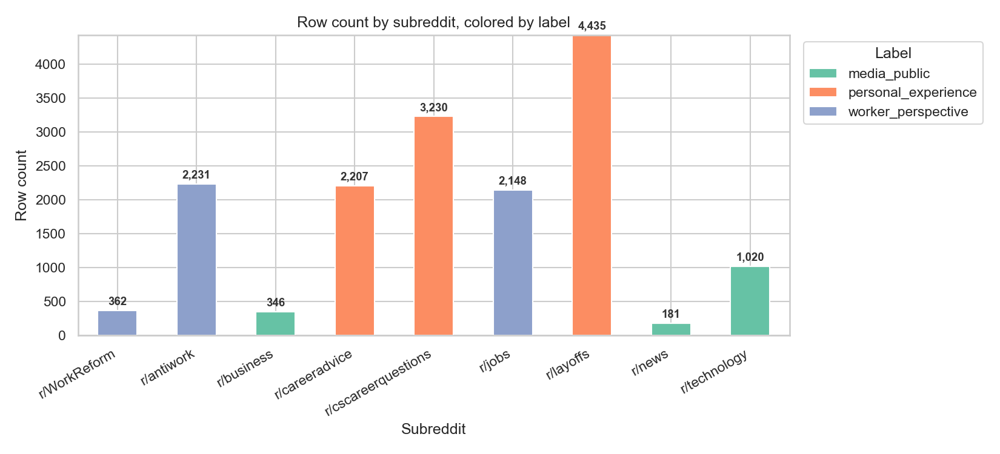
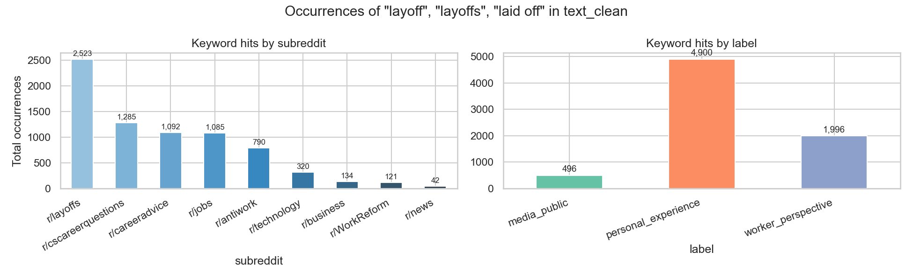
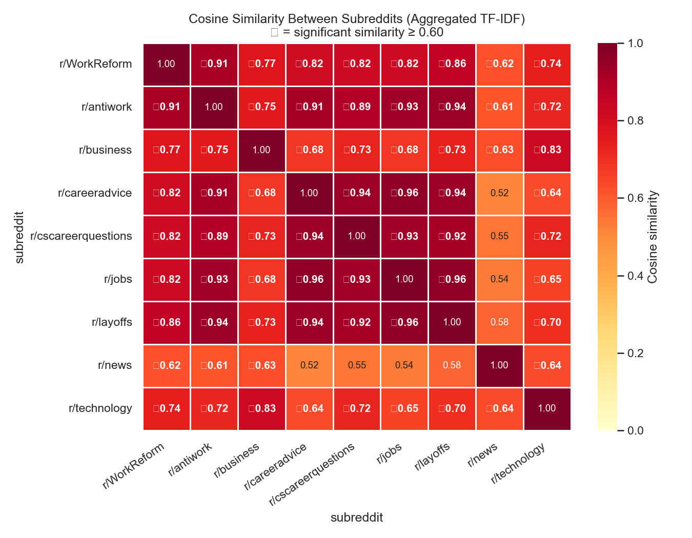
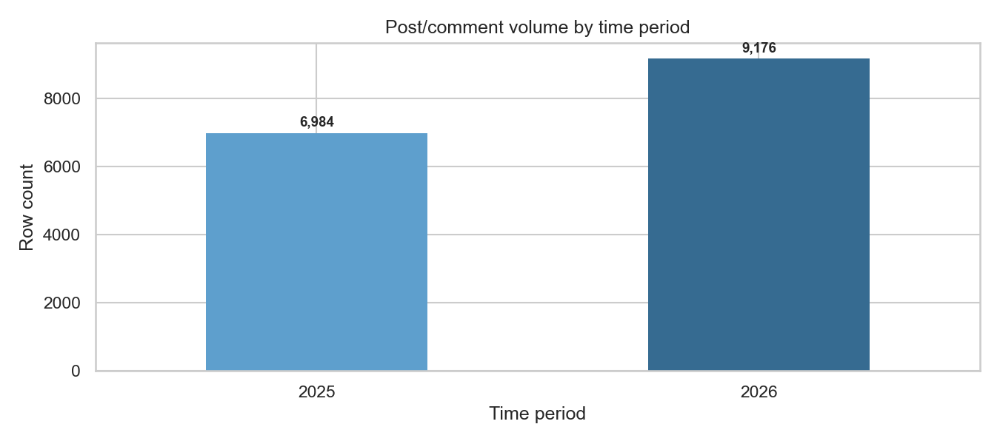
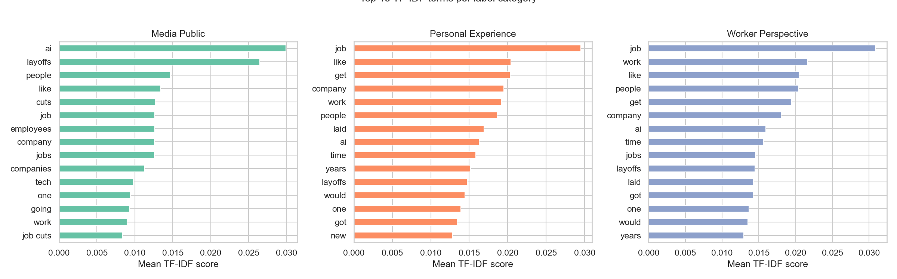
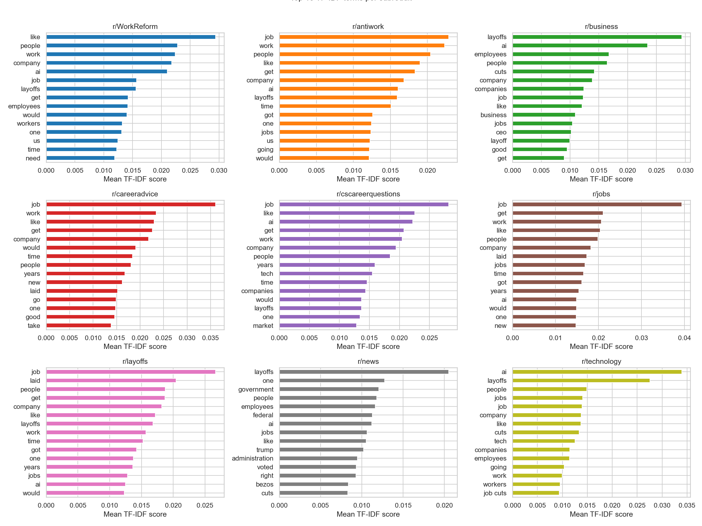
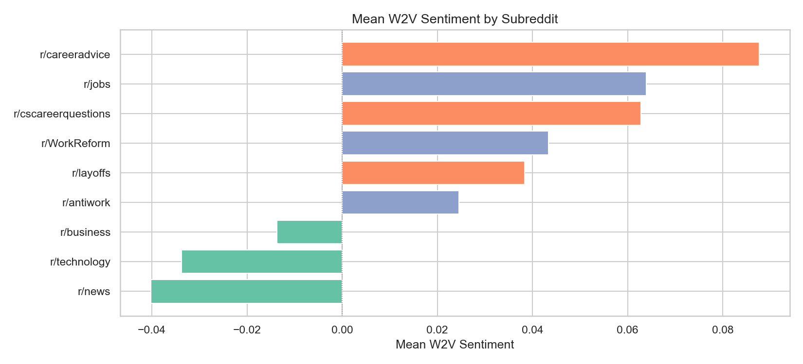
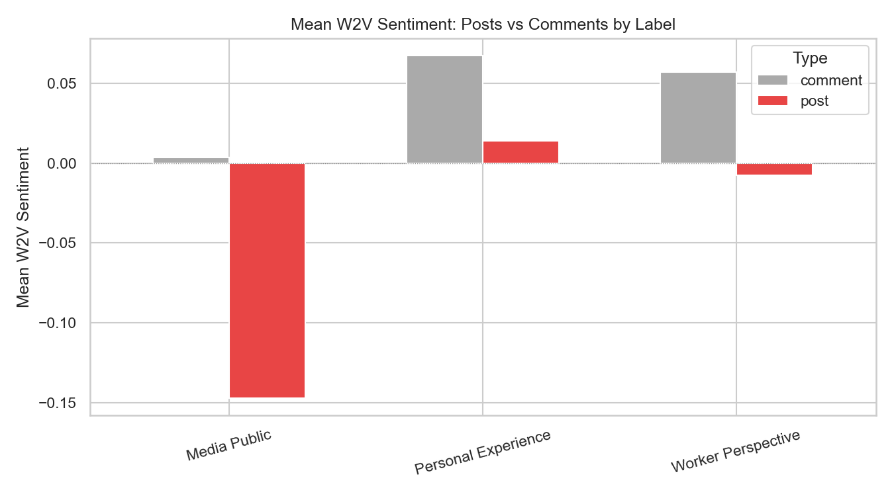
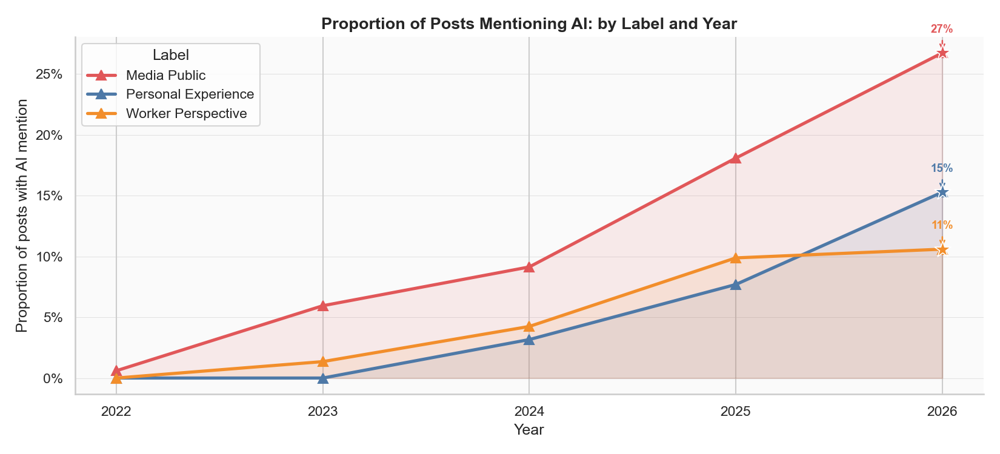
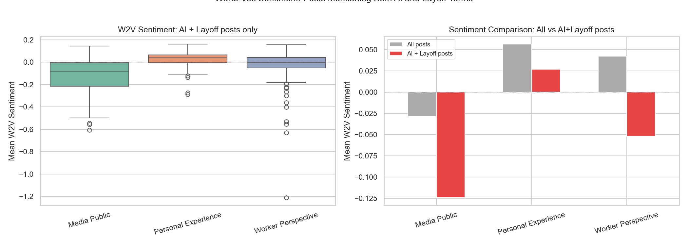

# IDS 570: Layoffs on Reddit — Computational Discourse Analysis

**Course:** IDS 570 — Natural Language Processing
**Dataset:** Reddit posts & comments scraped from 9 subreddits (2025–2026)

---

## Executive Summary

This project applies multi-method NLP analysis to 16,160 Reddit posts and comments from 9 subreddits (2025–2026), grouped into three discourse communities: `media_public`, `personal_experience`, and `worker_perspective`. The central finding is that the word *layoff* carries structurally distinct meanings across these communities — the media/non-media divide is cleanly recoverable by both TF-IDF (62.7% accuracy) and BERT embeddings, while the personal-experience vs. worker-perspective boundary is fuzzier, requiring lexical supervision to separate. In 2025–2026, worker communities are sharply more negative as AI-attributed layoffs dominate the discourse, while media communities remain institutionally neutral.

---

## Problem Statement

Online discourse about the 2025–2026 tech layoff wave splintered across communities with structurally different framing orientations — institutional reporting, personal job loss, and labor advocacy — each producing measurably different lexical, semantic, and affective signals. This project uses computational NLP methods to characterize those differences at scale.

---

## Research Question

How does the meaning of the keyword *layoff* vary across three
structurally distinct Reddit discourse communities (media/public,
personal experience, and worker perspective) during the 2025 to 2026
tech layoff wave?

| Label | Subreddits | Framing Style |
|---|---|---|
| `media_public` | r/news, r/business, r/technology | Third-person, institutional, scale-focused, company-anchored |
| `personal_experience` | r/layoffs, r/cscareerquestions, r/careeradvice | First-person, financially anxious, job-search oriented |
| `worker_perspective` | r/antiwork, r/WorkReform, r/jobs | Collective, politically charged, structural critique |

---

## Method & Pipeline

### Pipeline Flowchart

```
┌─────────────────────────────────────────────────────────────────┐
│  Step 1: DATA COLLECTION                                        │
│   Reddit API → 9 subreddits → deduplicate → label (n=16,160)   │
└────────────────────────────┬────────────────────────────────────┘
                             │
                             ▼
┌─────────────────────────────────────────────────────────────────┐
│  Step 2: PREPROCESSING                                          │
│         Clean text → TF-IDF matrix → corpus for W2V            │
└──────────┬────────────────────────────────────────┬────────────┘
           │                                        │
           ▼                                        ▼
┌──────────────────────┐               ┌────────────────────────┐
│  Step 3: EDA         │               │  Step 5: BERT          │
│  TF-IDF profiles     │               │  bert-base-uncased     │
│  Cosine similarity   │               │  [CLS] 768-dim         │
│  Word clouds / KWIC  │               └────────────┬───────────┘
│  Temporal trends     │                            │
└──────────┬───────────┘               ┌────────────▼───────────┐
           │                           │  Step 5: K-MEANS+UMAP  │
           ▼                           │   k=3 clusters         │
┌──────────────────────┐               │   2D projection        │
│  Step 4: NER         │               └────────────┬───────────┘
│  spaCy en_core_web_sm│                            │
│  ORG/GPE/DATE/MONEY  │               ┌────────────▼───────────┐
│  Co-occurrence nets  │               │  Step 6: CLASSIFICATION │
└──────────┬───────────┘               │   TF-IDF LR vs BERT LR │
           │                           │   Confusion matrices   │
           │                           └────────────┬───────────┘
           │                                        │
           └──────────────────┬─────────────────────┘
                              │
                              ▼
              ┌───────────────────────────────┐
              │  Step 7: SENTIMENT ANALYSIS   │
              │  Word2Vec scoring by label    │
              │  Time-series trends           │
              │  AI + layoff subset extension │
              └───────────────┬───────────────┘
                              │
                              ▼
              ┌───────────────────────────────┐
              │  Step 8: SYNTHESIS            │
              │  Cross-method findings        │
              │  Central claim + limitations  │
              └───────────────────────────────┘
```

---

### Step 1 — Data Collection
**Purpose:** Build a labeled corpus large enough to support statistical NLP methods across three distinct communities.

Reddit posts and comments were scraped from 9 subreddits using the Reddit API (`reddit_scraper_layoffs.py`), then merged and deduplicated (`combine_and_deduplicate.py`, n = 16,160, filtered to 2025–2026). Subreddits were assigned to one of three community labels based on their primary purpose and user base. Using subreddit membership as a weak label — rather than manually annotating individual posts — is justified by the high internal coherence of Reddit communities; users self-select into forums that match their framing orientation, making community membership a reasonable proxy for discourse type (Baumgartner et al., 2020).

### Step 2 — Preprocessing
**Purpose:** Normalize text so that downstream frequency and embedding methods operate on clean, comparable signals.

Raw text was cleaned by removing HTML artifacts, unicode noise, URLs, and stopwords (`preprocess.py`). A TF-IDF matrix was separately built with scikit-learn's `TfidfVectorizer` using unigrams and bigrams, with a minimum document frequency of 5 to filter rare tokens (`preprocess_tfidf.py`). Stopword removal follows NLTK's English list; domain-specific terms like "job" and "work" were retained because they carry discriminative signal across communities.

### Step 3 — EDA (Exploratory Data Analysis)
**Purpose:** Establish baseline evidence that the three communities differ in surface-level lexical composition before applying heavier models.

- **TF-IDF profiling:** Identifies the most community-distinctive terms per label.
- **Cosine similarity heatmap:** Measures pairwise lexical overlap between community centroids; low cross-community similarity validates the weak-label assumption.
- **KWIC sampling:** Examines how the keyword *layoff* appears in immediate context across labels — a direct test of the central claim.
- **Word clouds:** Visual confirmation that high-frequency and high-TF-IDF terms differ meaningfully across labels.
- **Temporal trends:** Tracks post volume over time to identify whether discourse spikes align with known real-world layoff events.

### Step 4 — NER (Named Entity Recognition)
**Purpose:** Identify which real-world actors (companies, places, money amounts) each community centers in its discussion.

Used spaCy (`en_core_web_sm`) to extract five entity types: ORG, GPE, DATE, MONEY, PERSON (`ner_extract.py`). Entity frequencies were then aggregated by label, and co-occurrence matrices and network graphs were computed to show which entities appear together within the same post (`ner_cooccurrence.py`). This approach was chosen over simple word frequency because named entities are semantically grounded — knowing that `media_public` centers *Amazon* and *Meta* while `worker_perspective` centers systemic terms reveals structurally different frames, not just different vocabularies.

### Step 5 — BERT Embeddings + UMAP
**Purpose:** Test whether communities are separable at the semantic (contextual) level, not just the surface lexical level.

`[CLS]` token embeddings were extracted from `bert-base-uncased` (768-dim) for each post (`bert_embeddings.py`). BERT was chosen over simpler embeddings (e.g., GloVe) because it captures contextual meaning — *laid off* in a personal narrative differs semantically from *layoffs announced* in a news report, even if the tokens overlap. K-means with k=3 was selected to match the three known community labels, enabling direct comparison between unsupervised cluster assignments and ground-truth labels. UMAP (McInnes et al., 2018) was used for 2D projection over t-SNE because it better preserves global structure at this dataset size and runs efficiently on CPU.

### Step 6 — Classification
**Purpose:** Quantify how well each feature representation can recover community labels, providing an upper-bound estimate of discriminability.

Logistic Regression was trained separately on TF-IDF features and on BERT embeddings (`classify_train_eval.py`). LR was chosen as the classifier because it is interpretable (coefficients directly identify discriminative features), fast, and well-suited for high-dimensional sparse inputs like TF-IDF. Comparing TF-IDF LR vs. BERT LR directly tests whether surface vocabulary or contextual semantics is more informative for this weak-label task.

### Step 7 — Sentiment Analysis
**Purpose:** Measure affective tone across communities and track how it evolves over time, particularly in response to the AI-driven layoff wave post-2023.

Word2Vec (window=5, Mikolov et al., 2013) was trained on the full corpus and used to compute semantic sentiment scores by projecting post embeddings onto a positive/negative axis defined by seed words (`sentiment_word2vec.py`). Window size 5 was selected to capture short-range syntactic context without diluting local semantic relationships. A temporal analysis and an AI-specific subset analysis (posts mentioning both AI and layoff terms) were added as extensions to test whether the post-2023 AI discourse shift is detectable as a sentiment change.

### Step 8 — Synthesis
**Purpose:** Integrate evidence across methods to assess the central claim and derive actionable conclusions.

Cross-method findings were combined to assess where community differences are robust (recoverable by multiple methods) vs. fragile (method-dependent). Limitations and directions for future work were identified.

---

## Findings

### Key Results Summary

| Method | Key Finding |
|---|---|
| TF-IDF / EDA | Subreddit membership is a reliable weak-label proxy; cosine similarity confirms distinct lexical clusters (career vs. media) |
| NER | *AI* and *Amazon* appear across all labels; DATE entities dominate; institutional vs. insider vs. labor framing is distinct by community |
| BERT + UMAP | Cluster 0 cleanly separates `media_public`; Clusters 1 & 2 overlap — personal experience and worker advocacy share semantic space |
| Logistic Regression | TF-IDF LR (62.7%) outperforms BERT LR (53%); bag-of-words is stronger than contextual embeddings for this weak-label task |
| Word2Vec Sentiment | Worker discourse is most negative throughout 2025–2026; media discourse stays institutionally neutral across the period |
| AI + Layoff Extension | Posts mentioning both AI and layoff terms are more negative than the corpus baseline; strongest effect in `worker_perspective` |

---

### EDA — Exploratory Data Analysis

**Corpus composition by subreddit and label.** Subreddit membership maps cleanly onto the three community labels, validating the weak-label assumption before any modeling.



**Layoff keyword frequency.** Keyword hit rates confirm that all communities discuss the same phenomenon — the signal difference lies in framing, not in topic coverage.



**Cosine similarity between subreddits.** Career subreddits cluster tightly (0.84–0.91), r/antiwork and r/WorkReform are highly similar to each other (0.89), and media subreddits are the most lexically distinct from all others.



**Post volume over time.** Volume is concentrated in 2025–2026, covering the peak of AI-driven layoff discourse, with 2026 showing the highest density (9,176 rows) across all communities.



**Top TF-IDF terms per label.** The most discriminative vocabulary per community confirms structurally different frames: company names for `media_public`, job-search terms for `personal_experience`, and collective-action language for `worker_perspective`.



**Top TF-IDF terms per subreddit.**



---

### Word Clouds

**TF-IDF-weighted word clouds by label.** TF-IDF suppresses terms common across all communities and surfaces terms that are *distinctively* frequent within each label — the vocabulary signals that drive classifier performance.

| media_public | personal_experience | worker_perspective |
|---|---|---|
|  |  |  |

---

### NER — Named Entity Recognition

**Top 10 entity types across the full corpus.** DATE entities dominate, confirming that temporal framing is central to layoff discourse. ORG entities are second — the type most likely to differentiate communities, since which organizations each group names differs by framing orientation.


**Top 15 ORG entities per label.** *AI* and *Amazon* appear across all three labels, but `media_public` treats them as newsworthy actors while `worker_perspective` cites them as structural antagonists. Surface entity overlap masks frame-level divergence.


**Word co-occurrence matrices.** Each cell shows how often two words appear in the same post. `media_public` shows tightly co-occurring corporate clusters; `worker_perspective` shows sparser, more diffuse co-occurrences — consistent with structural critique that references many actors rather than tracking specific company pairs.


**Co-occurrence network graphs.** `media_public` networks are hub-and-spoke around major corporations; `worker_perspective` networks are more distributed, reflecting systemic rather than firm-specific framing.

| media_public | personal_experience | worker_perspective |
|---|---|---|
|  |  |  |

---

### BERT + UMAP Clustering

**UMAP projection of BERT [CLS] embeddings (K-means k=3).** The left panel shows cluster assignments; the right shows ground-truth labels. `media_public` occupies a distinct semantic region. `personal_experience` and `worker_perspective` overlap substantially — they share vocabulary around financial stress and job loss even when their political framing differs, explaining why BERT-based classification (53%) struggles to separate them.


---

### Classification

**Confusion matrices: TF-IDF LR (62.7%) vs. BERT LR (53%).** TF-IDF outperforms BERT because surface vocabulary is more discriminative than contextual meaning when labels are defined by community norms. Both models show the same systematic confusion between `personal_experience` and `worker_perspective`.

| TF-IDF Logistic Regression | BERT Logistic Regression |
|---|---|
|  |  |

**TF-IDF feature weights per class.** The features with the highest coefficients per class identify the specific vocabulary each community owns — directly showing which words signal insider/worker framing vs. institutional/media framing.


---

### Sentiment Analysis

**Sentiment distribution by label and subreddit.** `worker_perspective` has both a lower median and higher variance than the other labels. r/antiwork and r/WorkReform drive most of the variance; r/news is the most consistently neutral.

| By Label | By Subreddit |
|---|---|
|  |  |

**Mean sentiment per label.** `worker_perspective` posts are substantially more negative on average, confirming that structural labor critique produces the most affectively charged discourse.


**Sentiment over time by label.** Worker community sentiment remains the most negative throughout 2025–2026, coinciding with the wave of AI-attributed layoffs, while media community sentiment remains flat.


**Post volume over time by label and subreddit.** Discourse is concentrated in 2025–2026 across all communities, reflecting the ongoing AI-driven layoff wave.

| By Label | By Subreddit |
|---|---|
|  |  |

**Mean sentiment by subreddit.** r/antiwork and r/WorkReform are the most negative; r/news and r/business the most neutral.



**Posts vs. comments sentiment.** Comments are consistently more negative than top-level posts within each label, reflecting the escalating tone of replies.



**AI mention rate over time.** Post-2023, all communities show rising AI mention rates, with `worker_perspective` showing the steepest increase — consistent with labor communities framing AI as a direct cause of layoffs.



**AI + Layoff posts sentiment.** Posts mentioning both AI and layoff terms are more negative than the corpus baseline across all labels, with the strongest effect in `worker_perspective`.



---

## UMAP Tableau Interactive Visualization

The video below demonstrates the interactive UMAP visualization built in Tableau, allowing exploration of BERT embedding clusters by label, subreddit, and time period.

https://github.com/user-attachments/assets/0d3795fb-a267-4873-8809-667c88b401af

---

## Central Claim

The word *layoff* carries structurally distinct meanings across Reddit communities. The media/non-media split is cleanly recoverable by both BERT and TF-IDF. The personal-experience vs. worker-perspective boundary is fuzzier — shared semantic vocabulary requires lexical supervision to distinguish. In 2025–2026, AI is central to discourse across all communities; worker communities are sharply more negative while media remains institutionally neutral.

---

## Repository Structure

```
IDS570_NLP/
├── notebook/
│   └── reddit_layoffs_discourse_analysis.ipynb   # Main analysis notebook
│
├── script/                     # Python scripts (run in order within each group)
│   ├── reddit_scraper_layoffs.py       # 1. Scrape Reddit posts
│   ├── combine_and_deduplicate.py      # 2. Merge per-subreddit CSVs, drop duplicates
│   ├── preprocess.py                   # 3. Clean text (HTML, unicode, stopwords)
│   ├── preprocess_tfidf.py             # 4. Build TF-IDF features
│   ├── ner_extract.py                  # NER: extract entities with spaCy
│   ├── ner_frequency.py                # NER: entity frequency analysis
│   ├── ner_visualize.py                # NER: charts
│   ├── ner_cooccurrence.py             # NER: co-occurrence matrices & network graphs
│   ├── kwic_sample.py                  # KWIC: keyword-in-context samples
│   ├── bert_embeddings.py              # BERT: extract [CLS] embeddings
│   ├── bert_cluster.py                 # BERT: K-means clustering
│   ├── bert_umap.py                    # BERT: UMAP projection & plots
│   ├── bert_examples.py                # BERT: representative examples per cluster
│   ├── classify_prepare.py             # CLF: train/test split & feature prep
│   ├── classify_train_eval.py          # CLF: train LR models & evaluate
│   ├── classify_features.py            # CLF: TF-IDF feature weight charts
│   ├── classify_predict.py             # CLF: predict on full dataset
│   ├── sentiment_word2vec.py           # Sentiment: Word2Vec semantic scoring
│   ├── sentiment_viz.py                # Sentiment: plots by label & subreddit
│   ├── sentiment_time.py               # Sentiment: time-series trends
│   └── save_all_figures.py             # Regenerate all figures to image/
│
├── data_ready/                 # Raw scraped CSVs (one per subreddit + combined)
│   ├── layoffs_reddit_data.csv         # Full combined dataset
│   └── layoffs_r_<subreddit>.csv       # Per-subreddit files
│
├── processed/                  # Intermediate outputs from scripts
│   ├── text_clean.csv                  # Cleaned text
│   ├── text_tfidf.csv                  # TF-IDF processed text
│   ├── ner/                            # NER entity data
│   ├── bert/                           # BERT embeddings & cluster assignments
│   ├── classification/                 # Train/test splits & predictions
│   ├── cooccurrence_*.csv              # Co-occurrence matrices per label
│   ├── kwic_examples.csv               # KWIC samples
│   └── layoffs_sentiment_w2v.csv       # Word2Vec sentiment scores
│
├── models/                     # Saved model artifacts
│   ├── model_bert_lr.pkl               # BERT + Logistic Regression
│   ├── model_tfidf_lr.pkl              # TF-IDF + Logistic Regression
│   ├── tfidf_vectorizer.pkl            # Fitted TF-IDF vectorizer
│   ├── word2vec_w5.bin                 # Word2Vec model (window=5)
│   └── w2v_corpus.txt                  # Corpus used to train Word2Vec
│
├── image/                      # All saved figures (organized by step)
│   ├── eda/
│   ├── wordcloud/
│   ├── ner/
│   ├── cooccurrence/
│   ├── network/
│   ├── bert/
│   ├── classification/
│   └── sentiment/
│
└── Instruction.pdf             # Assignment instructions
```

---

## Requirements

```
pandas>=2.0
numpy>=1.24
matplotlib>=3.7
seaborn>=0.12
scikit-learn>=1.3
spacy>=3.7          # python -m spacy download en_core_web_sm
transformers>=4.38
torch>=2.1
umap-learn>=0.5
nltk>=3.8
networkx>=3.2
wordcloud>=1.9
gensim>=4.3
```
